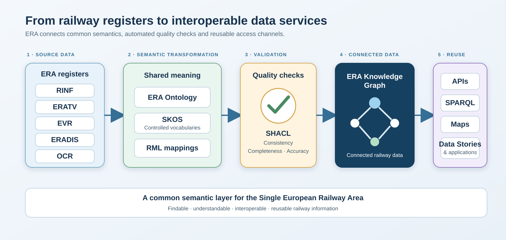

# ERA Knowledge Graph

*Page last updated: 19 September 2026*

## Making European railway data easier to connect, understand and reuse

The ERA Knowledge Graph transforms railway information into connected, machine-readable data.

It brings together data about the European railway infrastructure and authorised vehicle types using common identifiers, definitions and relationships. This makes it easier for people and digital systems to find information, combine data from different sources and answer questions about the European railway system.

The Knowledge Graph supports ERA's objective of improving data interoperability across the Single European Railway Area.

**Primary actions**

- [Explore RINF Data Stories](https://rinf.data.era.europa.eu/data-stories)
- [Browse the ERA Ontology](https://rinf.data.era.europa.eu/era-vocabulary/)
- [Query the Knowledge Graph](https://graph.data.era.europa.eu/)
- [Access technical resources](https://gitlab.com/era-europa-eu/public/interoperable-data-programme/era-ontology)

### Find your way in

**I'm a railway or policy user** — I want to explore infrastructure questions, maps and examples without writing queries.
→ [Explore resources for railway and policy users](#for-railway-and-policy-users)

**I'm a developer or data specialist** — I want to query the graph, download the ontology or reuse the mappings.
→ [Explore resources for developers](#for-data-specialists-and-developers)

## Why a railway Knowledge Graph?

Railway information is produced by many organisations and managed in different systems. The same concept may be represented using different names, formats or structures.

A Knowledge Graph helps address this problem by describing railway entities and their relationships consistently. For example, it can connect:

- an operational point to the sections of line serving it;
- a section of line to its tracks;
- a track to its signalling, energy, gauging and operational characteristics;
- infrastructure characteristics to the parameters defined in the applicable railway legislation;
- vehicle types to the infrastructure conditions relevant to their operation.

This connected representation makes railway information more understandable to both humans and machines.

## What does it contain?

### Register of Infrastructure — RINF

RINF describes the characteristics of the European railway infrastructure, including operational points, sections of line, tracks, tunnels, platforms, sidings, signalling systems, energy systems and other infrastructure parameters. RINF is the Knowledge Graph's primary, live source today.

### Coverage roadmap

Knowledge Graph coverage is expanding register by register, not all at once:

| Register | Status |
|---|---|
| **RINF** — Register of Infrastructure | Live and primary |
| **OCR** — Organisation Code Register | Ready — [query the OCR-KG repository](https://graph.data.era.europa.eu/?repositoryId=OCR-KG) |
| **EVR** — European Vehicle Register | Migration ongoing |
| **ERADIS** — interoperability and safety documents | Migration ongoing |
| **ERATV** — European Register of Authorised Types of Vehicles | Migration ongoing |
| **ERA-Lex** — structured legal references | Ready — [query the era-lex repository](https://graph.data.era.europa.eu/?repositoryId=era-lex); direct links from infrastructure and vehicle data to specific legal provisions are still being extended |

Each register keeps its own authoritative source system; the Knowledge Graph adds a shared, queryable representation on top, using the same identifiers and relationships across registers as they come online.

## How does it work?

ERA transforms information from its source registers into connected RDF data. The ERA Ontology gives that information a shared meaning. Controlled vocabularies provide harmonised values, while SHACL rules validate quality and consistency. The resulting Knowledge Graph can be accessed through APIs, SPARQL queries, maps, Data Stories and other digital applications.

The architecture is illustrated below.

| Element | Purpose |
|---|---|
| ERA Ontology | Defines railway entities, properties and relationships in a human- and machine-readable form. |
| Controlled vocabularies (SKOS) | Provide harmonised lists of values for parameters such as operational-point types, gauges, energy systems and ETCS levels. |
| SHACL validation rules | Express data-quality and consistency requirements. |
| Knowledge Graph | Contains instances of railway infrastructure and vehicle data connected using the ontology. |
| SPARQL service and APIs | Enable users and applications to query and reuse the connected data. |
| Data Stories and maps | Turn railway questions into understandable examples, results and visualisations. |

The ERA Ontology is a Technical Document issued by ERA pursuant to Article 4(8) of Directive (EU) 2016/797. It establishes human- and machine-readable definitions and associated data-quality requirements and is maintained to reflect regulatory and technical developments.

**Current release:** ERA Ontology v3.3.4 (12 August 2026) — see all [ontology releases](https://gitlab.com/era-europa-eu/public/interoperable-data-programme/era-ontology/era-ontology/-/releases). The Knowledge Graph itself is refreshed from source registers on an ongoing basis as new data is published.

Each domain's technical annex — the detailed Application Guide behind the ontology — is published separately:

| Domain | Application Guide |
|---|---|
| RINF | [rinf-appGuide](https://rinf.data.era.europa.eu/era-vocabulary/rinf-appGuide/) |
| EVR | [evr-appGuide](https://rinf.data.era.europa.eu/era-vocabulary/evr-appGuide/) |
| ERADIS | [eradis-appGuide](https://rinf.data.era.europa.eu/era-vocabulary/eradis-appGuide/) |
| ERATV | [eratv-appGuide](https://rinf.data.era.europa.eu/era-vocabulary/eratv-appGuide/) |

## What can users do with the Knowledge Graph?

The Knowledge Graph can support questions such as:

- Which infrastructure characteristics are available for a railway route?
- Which tracks use a particular electrification or signalling system?
- Where are specific gauging profiles available?
- Which infrastructure parameters are missing or incomplete?
- How are operational points connected through sections of line?
- Which infrastructure characteristics may be relevant to route-compatibility checks?
- Which infrastructure characteristics may be relevant to create a digital route book?
- How can RINF information be combined with other European datasets?
- How can machines send future-proof vehicle data for faster verification and authorisation?

### Featured Data Stories

A Data Story turns one of these questions into a plain-language explanation, a query, a result and a visualisation — no SPARQL required to read it. Each story is stored under a stable identifier in the Data Stories catalogue; the corporate website links to the story, never to a long, encoded query URL.

**How many kilometres of railway tunnel does each country report?**
Combines tunnel identification and length records across every national infrastructure manager, removing duplicate reports of the same physical tunnel.
**[Explore →](https://rinf.data.era.europa.eu/data-stories)**

**Which railway lines are electrified, and with which energy supply system?**
Matches sections of line to their energy-system parameters — relevant for planning cross-border journeys and multi-system rolling stock operation.
**[Explore →](https://rinf.data.era.europa.eu/data-stories)**

**Where can vehicles of a given wheel-set gauge run?**
Surfaces the gauging parameters recorded per section of line — relevant for standard-gauge, Iberian-gauge and other rolling-stock compatibility checks.
**[Explore →](https://rinf.data.era.europa.eu/data-stories)**

**Which lines support ETCS, and at what baseline and level?**
Reports the ETCS baseline and level recorded per section — a first step in checking route compatibility for ERTMS-equipped trains.
**[Explore →](https://rinf.data.era.europa.eu/data-stories)**

**Which operational points have no recorded connection to the rest of the network?**
Flags operational points that appear isolated in the data — useful for spotting genuine dead-end sidings as well as data-quality gaps worth reporting back to the infrastructure manager.
**[Explore →](https://rinf.data.era.europa.eu/data-stories)**

## Explore ERA's semantic resources

### For railway and policy users

**[RINF Data Stories](https://rinf.data.era.europa.eu/data-stories)**  
Explore practical questions about the European railway infrastructure through maps, tables and explanatory examples.

**[ERA Ontology](https://rinf.data.era.europa.eu/era-vocabulary/)**  
Browse the definitions and relationships used to describe railway infrastructure and vehicle-type data.

**ERA controlled vocabularies**  
Explore the harmonised values used for railway parameters through [EU Vocabularies](https://op.europa.eu/en/web/eu-vocabularies/era).

### For data specialists and developers

**SPARQL query service**  
Run structured queries against the RINF Knowledge Graph, with other registers added as they complete migration (see [Coverage roadmap](#coverage-roadmap)).

**Ontology source and releases**  
Download the ontology and inspect releases, documentation and change history in the [ERA Ontology GitLab repository](https://gitlab.com/era-europa-eu/public/interoperable-data-programme/era-ontology/era-ontology).

**Knowledge Graph mappings**  
See how source data for RINF is transformed into RDF in the [ERA KG Mappings](https://gitlab.com/era-europa-eu/public/interoperable-data-programme/era-ontology/era-kg-mappings) project (RML/YARRRML mappings).

**Controlled vocabularies and validation rules**  
Reuse the SKOS concept schemes and SHACL shapes supporting consistent railway data.

## Data quality and governance

ERA governs and maintains the ontology, controlled vocabularies and validation rules in cooperation with railway domain experts.

This work aims to ensure that:

- definitions remain aligned with the applicable legal and technical framework;
- data can be interpreted consistently across systems;
- quality requirements can be checked automatically;
- changes are documented and versioned;
- semantic resources can be reused by railway stakeholders and application developers.

The ontology is distributed under the [European Union Public Licence, Version 1.2 (EUPL 1.2)](https://interoperable-europe.ec.europa.eu/collection/eupl/eupl-text-eupl-12).

## Contribute or contact ERA

ERA welcomes feedback on:

- ontology definitions and modelling;
- controlled vocabularies;
- data-quality rules;
- documentation;
- new competency questions and Data Stories;
- potential reuse cases.

Technical issues and proposed changes should be submitted through the relevant ERA GitLab project. General questions can be sent to the ERA Interoperable Data Programme team at [servicedesk@era.europa.eu](mailto:servicedesk@era.europa.eu).
